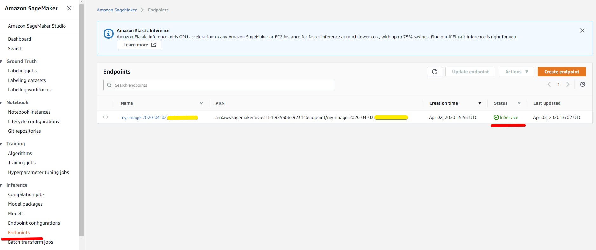

# TC - Challenge success prediction API

## Prerequisites
1. Node.js 12+

## Config Variables
Set the following variables:
 
 **LOG_LEVEL** - the log level.  
 **PORT**  - the application port.  
 **TOPCODER_API** - URL to use to get data, e.g. challenge data.  
 **TOPCODER_AUTH_TOKEN** - Topcoder Auth token.
 **AWS_REGION** - AWS region must match the region where a model deployed.  
 **AWS_ACCESS_KEY** - AWS access key ID. 
 **AWS_SECRET_KEY** - AWS secret key.

 **DEFAULT_MODEL** - the default model name. 

 Each model has the properties:

 **endpointName** - the name of a persistent endpoint to get predictions from the model.
 The endpoint name can be found during  
 or .   
 **path** - the file path to a model js file, e.g. '/models/DefaultModel.js'.  
 **enabled** - true/false. If false then the model can't be used and User will get 400 http error.  

Example: 
```
  DEFAULT_MODEL: 'lightgbmModel',
  MODELS: {
    lightgbmModel: {
      endpointName: 'my-image-2020-04-02-16-45-26-479',
      path: '/models/DefaultModel.js',
      enabled: true
    }
  }
```
# Using the application
Go to the the root folder:
1  Install dependencies with `npm install`
2. Lint code with `npm run lint` 
3. Configure all config variables in `config/default.js` and set environment variables. 
4. Run the application with `npm run start`

# Verification
## Prerequisites
1. The model was deployed on AWS and the endpoint was created successfully. 
The status of the endpoint should be 'InService'. You can check it in AWS Console.
Go to 'Amazon Sagemaker', click on 'Inference' and click on 'Endpoints'.  
See 

2. Node.js 12+

## Setting Config Variables 
1. Configure all config variables in `config/default.js`. 
You need to replace <ENDPOINT_NAME> with your endpoint name and set environment variables(AWS_REGION) at least. 

## Running the application
1.Testing the application with a default model:

```
curl --location --request POST 'http://localhost:3000/predict' \
--header 'Content-Type: application/json' \
--data-raw '{
  "challengeId": "30120975"
}'
```
The output:
```
{"prediction":"success"}
``` 

2.Testing the application with the model parameter:

```
curl --location --request POST 'http://localhost:3000/predict' \
--header 'Content-Type: application/json' \
--data-raw '{
  "challengeId": "30120975",
  "model": "lightgbmModel"
}'
``` 
The output:
```
{"prediction":"success"}
``` 

3.Testing with non-existing challenge:
```
curl --location --request POST 'http://localhost:3000/predict' \
--header 'Content-Type: application/json' \
--data-raw '{
  "challengeId": "120975",
  "model": "lightgbmModel"
}'
```
The output:
```
{"message":"The challenge does not exists with the id:120975"}  
```

4.Testing with a missing/wrong model endpoint:
Update a default model:
``` 
  MODELS: {
    lightgbmModel: {
      endpointName: 'my-image-dummy',
      path: '/models/DefaultModel.js',
      enabled: true
    }
  }
```
Use the command:
```
curl --location --request POST 'http://localhost:3000/predict' \
--header 'Content-Type: application/json' \
--data-raw '{
  "challengeId": "30120975",
  "model": "lightgbmModel"
}'
```
The output:
```
{"message":"Endpoint my-image-dummy of account 925306592310 not found."}
```

# How add a new model 
1. Create a js file in the folder 'models' and implement one method at least
which should return {"prediction": "success or fail"}.
The params includes challenge data and endpointName: 
```
const predictSuccess = async (params) => {
 <YOUR IMPLEMENTATION>
}
```
2. Add your model in MODELS in `config/default.js`:
```
     <YOUR_MODEL_NAME>: {
        endpointName: '<YOUR_MODEL_ENDPOINT_NAME>',
        path: '/models/<YOUR_JS_FILE_NAME>.js',
        enabled: true
     }
```
